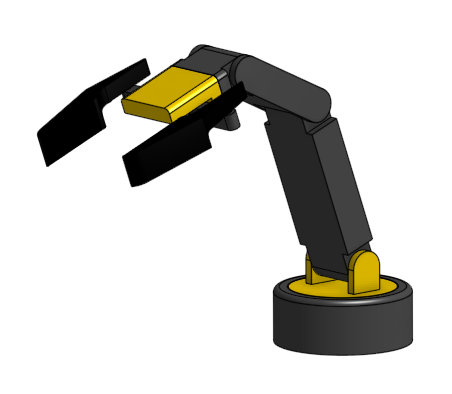
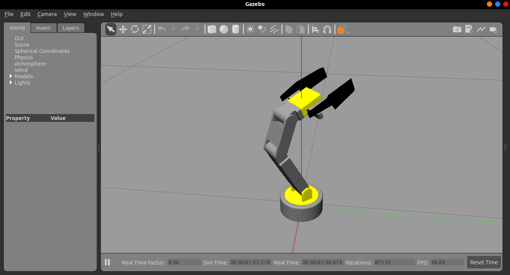
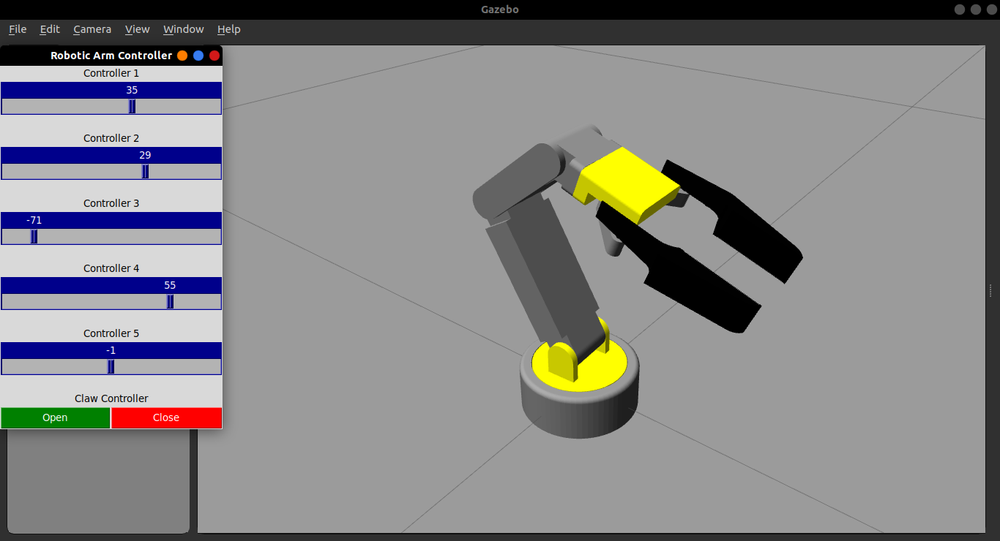

# Robotic_Arm

[](https://github.com/Sakshi-1606/Robotic_Arm/issues)


## Overview
A ROS package to simulate a simple 5 DOF robotic arm in gazebo and also to control it using a Tkinter UI based controller.



*Robotic Arm Model*

## Technologies Used


## Implementation

### Designing the Arm

The robotic arm is designed in Onshape, a CAD software. The model is then exported as a URDF file along with the mesh files using the ```onshape-to-robot``` tool.

### Integrating with ROS

The ROS control plugin is used for controlling each joint in the robotic arm via a dedicated topic. The plugin also provides topics to tune the PID variables for each joint's control system.

### Creating the Controller

The controller is created using Tkinter, a GUI module for python.

## Getting Started

### Prerequisites

* Ubuntu 20.04
* ROS Noetic 

> For installing ROS refer to [ROS Wiki](http://wiki.ros.org/noetic/Installation)

### Installation

Create a catkin workspace

```bash
mkdir ros_ws
cd ros_ws
mkdir src
catkin build
```
To automatically source this workspace every time a new shell is launched, run these commands

```bash
echo "source ~/ros_ws/devel/setup.bash" >> ~/.bashrc
source ~/.bashrc
```

Clone the repository in the `src` folder in the catkin workspace.

```bash
cd ~/ros_ws/src
git clone https://github.com/Sakshi-1606/Robotic_Arm.git
```

Navigate back to the workspace folder and build the packages.

```bash
cd ~/ros_ws
catkin build
```

## User Guide

### Launching Gazebo Simulation

To launch the gazebo simulation use the command

```bash
roslaunch roboticarm roboticarm_simulation.launch
```


<br>
*Robotic Arm Simulation World*

### Using the Controller

To access the controller run the command

```bash
rosrun roboticarm arm_controller.py 
```



## References

- [ROS Wiki](https://wiki.ros.org/Documentation)
- [ROS Control | ROS Robotics Learning](https://www.rosroboticslearning.com/ros-control)
- [ROS Control | Gazebosim](https://classic.gazebosim.org/tutorials?tut=ros_control)

## Project Mentors:

1. [Joel Jojo Painuthara](https://github.com/JoelJojoP)
2. [Sakshi Bothra](https://github.com/Sakshi-1606)

## Project Members:

1. [Bakti Raju Karchi](https://github.com/bhakti269)
2. [Mohammed Shadab Alam](https://github.com/flame-2005)
3. [Nithin S](https://github.com/Nithin1729S)
4. [Sonali Kannojiya](https://github.com/Sonali9867)

## License:

This repository is licensed under the [BSD-3-Clause License](https://github.com/Sakshi-1606/Robotic_Arm/blob/main/LICENSE)